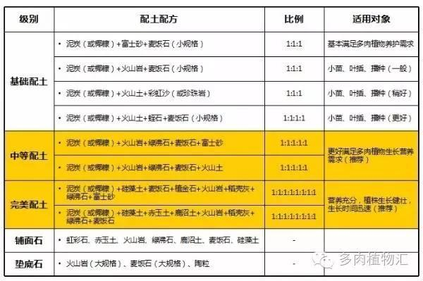

 http://www.tsherb.com.tw/indexDetail.php?ed_id=1  
http://www.bonsai-net.com/class.html  

# 心得
1. 催芽：種子要先放衛生紙噴水，在溫暖陽光下發芽再土植，比較難出芽的植株可以先放溫水一晚再放衛生紙(溫湯浸種)，幼苗先用緩效肥促進生長    
2. 間拔：去弱留強，選莖粗的苗   
3. 生根：香草類植株剪莖放水裡生根再土植，發根前植株要蓋著保濕  
4. 澆水：『土乾再澆、每澆必濕』，『澆水要暴飲暴食、施肥要少量多餐』  
5. 摘葉：要留幾片行光合作用  
6. 種植：深不埋心 淺不漏根  

# 可以種
## 無花果  
## 秋葵  

# 正在種
## 鳳梨頭
肉跟底下幾片葉子拔掉會看到生根點，放水中生根再土培  

## 燈籠果
季節: 春秋  
光: 白天20-28度 ，  夜間14-17度  
水: 夏季的時候3-5天就可以澆一次水，正常情況下每5-7天就要澆一次水        
土: 沙質土， PH值6.5-7.5的土壤較為適宜   
肥:  果實膨大之後，就要追加第2次肥料  
栽培:   
在壯苗的期間，一般會對燈籠果進行兩次間苗操作，在燈籠果第一片真葉露心時，就會進行第一次間苗，此時會留2-3株壯苗。而當燈籠果出現2-3片真葉時，就會進行二次間苗，只留一株壯苗  

# 有存活
## 薄荷
季節:春末 初秋分株  
光: 半日照   
水: 土不可乾透,夏要比較多水避免枯黃,秋冬少水      
土: 底部碎石排水  
肥: 氮,不太需肥，2個月一次  
栽培: 春秋換盆,將薄荷的枝葉從頂端剪約5-10cm  
儘量找剛發芽而枝葉是嫩綠色的，去除底部葉片  
插水生根再植土    

## 香蜂草
季節:春末 初秋 怕熱  
光: 半日照 可跟薄荷一起  
水: 夏要比較多水避免枯黃,秋冬少水,別澆葉子      
土: 略濕,微酸ph6-7   
肥: 氮,不太需肥，2個月一次 
栽培: 可以杆插  

## 虎尾蘭
``耐陰植物 ``  
https://github.com/eric999j/Clutter/blob/master/5.2.3.%E7%94%9F%E6%B4%BB-%E5%81%A5%E5%BA%B7%E7%9A%84%E7%A9%BA%E6%B0%A3.md  

# 沒存活
## 迷迭香-日照不夠，太悶濕
季節:春末 初秋分株,避免高溫多濕的氣候及環境    
光:  保持全日照,乾爽    
水:  土很乾再灑一點水     
土:  微酸ph6-7, 防止土散     
肥:  不需要肥料  
栽培: 植株要能通風、保持涼爽,空氣流通,要剪掉過多和老化的枯枝葉，並撿拾落在盆土表面的枯枝葉  

## 番茄-土不好  
季節: 避開夏天及雨水比較多的季節   
光: 溫暖乾燥， 氣溫低於15度或高於32度是不宜種植的，果實溫度18~26度最適合  
水: 不澆低溫水，陰天不澆水，傍晚不澆水，不大水漫灌  
土: 要求比較濕潤而且疏鬆的土壤  
肥:  需要大量的肥料  
栽培:   
缺鈣:末端枯黑,土石灰    
缺硼:環狀龜裂,水硼  
要溫湯浸種催芽

## 西印度櫻桃-種子未成熟  
季節: 一年有兩次的花期，分ㄢ按別在5,6月以及10,12月。 一年兩次結果期，分別在3,4月以及7,8月  
光:   全日照
水: 澆至盆底透水        
土: 沙質土， PH值6.5-7.5的土壤較為適宜   
肥:  以有機質肥料及化學肥料並重    
栽培: 
西印度櫻桃採收後，將果皮果肉搾破取出果核，並以清水洗除附著果核外之果  
肉，而後將之放在陰涼處晾乾 1～2 日即可播種。播種時將果核直接播在淺盆或  
72 格穴盤中，播後約 10～30 天發芽，高溫期發芽較快，低溫期發芽甚慢。待幼  
苗長至 5～10 公分時，再將之移植於塑膠軟盆中。  
剛開花時就要先用毛筆授粉，再噴著果劑(劑量1:100不可多及少，不然沒用)，對花噴(霧狀)有噴到有濕就好~噴多了一樣會落花  

# 未來  
有些東西盆栽種不起來，哪天有院子再說  

## 三寶柑 
## 黃金果
## 餘甘子
## 野薑花
## 月桃
## 樹葡萄 
## 仙桃
## 四季金桔

# 香草
大部分植物都能接受的土壤是—排水良好的沙質壤土 。如果是盆栽，則以泥碳苔為主成分的培養土(泥碳土)，再自行調配1╱4的河沙  
草本植物在每次修剪後就要施肥   
用手直接去觸摸土壤，還濕濕的，就不要澆水，有一點乾才澆水。澆水就要一次澆到溼透為止  
有些植物很不耐積水，如：薰衣草、迷迭香，在澆水後要把多餘的水滴乾  
大部份的香草植物都要全日照栽培  

# 介質

## 排水層  
陶粒: 大顆粒、質地輕、多孔、透氣性好、穩定  
缽底石: 質地輕、透氣、保水  
碎竹炭: 質地堅硬、通氣性好、具有良好的吸附能力，抑制細菌  
綠沸石：用綠沸配土最大的作用在於防止植株根腐爛，有效抑制土壤中有害物質繁殖，提高肉肉抗病抗旱抗逆能力。同時具有吸附緩釋分子能力，緩釋養分，防止燒苗，通氣性好，可長期保持疏鬆，具有貯存和提供氧氮的功能  

## 中層
## 土
* 泥炭土：又稱黑土、草炭，是古代低溫、濕地的植物遺體，被埋在地下，經數千萬年的堆積，在氣溫較低、雨水較少或缺少空氣的條件下，植物殘體緩慢分解而形成的特殊有機物，多呈棕黃色或淺褐色。也是一種多肉配土的最佳介質。 盆栽常用，管理時最好在介質未完全乾燥之前即應澆水，  久了會軟腐黏膩而降低透氣性與排水性，如果還是密集澆水就很容易造成過度潮濕的爛根現象  
* 火山土：火山土是由火山噴發後的灰燼凝固而成，蘊含多種微量元素和礦物質，這些成分讓火山泥的物理特性十分穩定，並且廣泛應用於各種領域，因其獨具的高通透性與保水性更是廣泛用於多肉植物的栽培基質  
* 硅藻土：硅藻土是一種優良的基質成分,其吸水、保水性能強，栽培花卉的生理指標和形態指標更優,不易爛根。是作為多肉植物、景天、生石花等鋪面土，十二卷等混合顆粒緩釋肥直接使用，也可以與泥炭土等混合使用  
* 赤玉土：由火山灰堆積而成，是運用最廣泛的一種土壤介質。這也是在日本運用最廣泛的一種栽培介質。它是高通透性的火山泥，暗紅色圓狀顆粒，沒有有害細菌，PH值呈微酸。 含有一定磷鉀肥，PH呈微酸性，高通透性，蓄水排水能力佳，無蟲卵細菌 
* 鹿沼土：一種罕見的物質，產於鹿沼地區的火山區，是由下層火山土生成，呈火山沙的形式，PH值呈酸性，有很高的通透性、蓄水力和通氣性。產於火山區，是由下層火山土生成，呈火山沙的形式。PH值呈酸性，有很高的通透性、蓄水力和通氣性。尤其適合嫌氣、忌濕、耐瘠薄的植物，如各類盆景、蘭花、高山花卉  

## 填充
* 白火山岩：又稱火山石，具有保水和透氣的特性，同時質地較硬，比赤玉土還硬，富含矽、鋁鐵、鉀、鈉、鈣、鎂、錳、磷等常量元素以及其它多種微量元素，適合用來種植多肉、國蘭等這類對透氣性要求較高的植物  
* 黑火山岩：又稱黑金砂，富士砂，是火山爆發後形成的多孔形石材。具有質地硬朗，良好的通氣排水性能，含多種火山有益元素，在種植上可用於植物混料、鋪面、墊底等方面。適合於仙肉、盆景、蘭花種植等品種  
* 椰糠：椰糠是椰子外殼纖維粉末，是加工後的椰子副產物或廢棄物。是從椰子外殼纖維加工過程中脫落下的一種純天然的有機質介質。經加工處理後的椰糠非常適合於培植植物。一、天然、純有機；二、對環境不會造成污染；三、保水性強；四、透氣性佳；五、植物成長最佳的有機介質  
* 稻殼灰：稻殼灰又稱薰炭，是以稻殼為原料經薰制而成。質量輕，透氣性、保肥性好，吸附性強。PH值呈鹼性，含有植物所需的磷、鉀、鎂等元素。同時稻殼灰有很多的細孔，為微生物提供了良好的生存環境，很好地促進了土壤微生物的活化。含有一定的鉀肥，鹼性比較高，不適用於種植喜酸性土壤的花卉（例如茉莉、梔子），但喜歡偏鹼性土壤的植物就非常適合（例如鐵線蓮）  
* 珍珠岩：一種火山噴發的酸性熔岩，經急劇冷卻而成的玻璃質岩石，因其具有珍珠裂隙結構而得名。珍珠岩的本身性質穩定，持水保肥能力強，可用來做盆栽混合物和土壤改良與泥炭土依體積以1：1混合，是良好蘭花栽培介質，  但時間久了很容易崩解而失去功能（用手一捏就碎），  白火山岩比較好    
* 蛭 石：蛭石主要作用是增加土壤（介質）的通氣性和保水性。因其易碎，隨著使用時間的延長，容易使介質緻密而失去通氣性和保水性，所以粗的蛭石比細的使用時間長，且效果好。質地輕、保水透氣性好，蛭石效果不若珍珠石  
* 彩虹沙：彩虹沙有很好的透氣性，使用彩虹沙配土可以增強土壤的防澇能力，特別適用於大多數喜歡澆水的手賤黨。使用彩虹沙配土的土壤具有較好的持水力不易分解，變碎，不滋生蚊蟲，保肥能力強等特點  
* 粗河沙: 常與泥炭土、園林土等混合使用改善土塘結構，增大孔隙度，但久了容易板結    
* 鍛燒粘土: 適用於栽培期較長的盆栽介質  
* 植金石：植金石也是一種火山石，是火山爆發之後，釋放大量氣體、熱量，經特殊溫度而形成的多孔、體輕、能迅速吸取養分、保持水分的石頭，再經過高科技技術加工而成。因而其具備體輕、排水、保濕、透氣性俱佳的特性。不論單獨使用，或與其他基質混合使用，均可發揮極佳效果  
* 虹彩石：也稱彩虹石，是一種配方型介質，各個廠家生產的配方略有不同。一般來說，基本都包含：輕石、沸石、熔岩石、控釋肥等。在植物栽培過程中通常用作底石及鋪面使用  

## 蘭
* 薇根: 含有2～3%的氮，可慢慢分解釋出  
* 蛇木: 排水迅速、通氣性高而保水性低  
* 樹皮: 分解時有大量的微生物參與，故氮肥的施用量要較多  
* 水苔: 吸水性、保水性特佳  
* 岩棉: 歐美盛行用岩棉做養液栽培種植番茄、小黃瓜、甜椒、玫瑰、非洲菊、東亞蘭及蝴蝶蘭等。台灣則應用於蝴蝶蘭及蕙蘭類  

## 配土
適合多數植物：泥炭土+珍珠岩+赤玉土+稻殼灰\碎竹炭  
適合播種育苗：泥炭土+稻殼灰+粗河沙  
適合扦插育苗：泥炭土+蛭石  
多肉植物配土比例：泥炭土+椰糠+珍珠岩+粗河沙  

  

## 鋪面
松鱗: 質地輕、透氣、保水排水性能好、微酸性  
麥飯石：麥飯石是一種天然的矽酸鹽礦物，學名：石英二長岩。麥飯石對生物無毒、無害並具有一定生物活性的複合礦物或藥用岩石。 麥飯石的主要化學成分是無機的矽鋁酸鹽。其中包括SiO2、Al2O3、Fe2O3、FeO、MgO、CaO、K2O、Na2O、TiO2、P2O5、MnO等，還含有動物所需的全部常量元素，如：K、Na、Ca、Mg、Cu、Mo等微量元素和稀土元素。麥飯石能夠穩定和提高、平衡土壤的物理機能，所以它比其它土壤改良劑更有優勢。正因為這樣，麥飯石成為廣大多肉植物愛好者的必備的配土介質。
細白石:   
粗河砂:   

# 肥料
農委會所發表的資料說明，有機肥中的碳氮比最佳值在15:1-20:1之間，可以提供土壤中益菌與植物生長的共同需要  
好氧性堆肥化所需時間約一個月，而厭氣性發酵法需四個月以上   
味道變臭時可以加入碳元素，像是報紙，瓦楞紙，葉子之類的；不過如果堆肥一直沒有發酵，可以加入有點氮的東西  
保持適當水分寧願少一點, 也不要過多。一般生垃圾含水率通常在 40-65% 範圍內，若作好氣性堆肥時以50-60% 含水率為最佳   
半熟肥：一般指堆肥材料明顯或稍微還看得出原本的樣子；其肥份新鮮有效，對土壤改良效果佳  
完熟肥：則是堆肥材料多數已經粉碎並轉為黑褐色手感膨鬆，不結塊，聞起來有泥土的香氣，沒有惡臭或阿摩尼亞的味道。以石蕊試紙測試時，酸鹼值<PH值>趨於中性。其肥份較差但較穩定，對土壤改良效果有限  
一點點霉臭味，表示腐熟狀況好，強烈的氨刺鼻味，則表示腐熟不夠完全  
腐熟堆肥會沈入水中  
化學肥料之過度使用的結果，土壤中有益微生物死亡，農地呈現劣化、硬化、酸化現象，缺乏有機質及各種礦物元素，而使劣地生產力與產品品質降低，必須補充有機質肥料加以改良，以增進地力，提高作物品質   
氮肥適合在枝葉即將長出時使用  
堆肥應該無惡臭，稀釋1000-3000倍  
奧斯魔肥有微量元素，比好康多好  
底肥要看植物生長的階段下  

# 營養
幼年期或正值成長發育階段，最需要高氮肥，能使它長大的營養，例如：花寶二號、花寶五號  
開花結果期要施用含磷鉀肥較高的肥料，以使花美果大，例如花寶三號、漁人魚精開花肥  
花謝果熟後，也要像人類產後補身一般，補充適當的肥料，應迅速施花寶二號  

## 三要素(氮葉磷花鉀根莖) 
### 葉肥的氮(N):莖葉肥大
構成胺基酸與葉綠素不可或缺的成分，而胺基酸又是構成一切生物細胞主要成分 - 蛋白質的原料，缺乏氮植株矮小，細弱；葉呈黃綠、黃橙等非正常綠色，基部葉片逐漸乾燥枯萎，過酸的土壤會造成氮肥吸收不良、也容易造成微量元素過度吸收而重金屬中毒、還會導致根部發展不良  
* 堆肥：霉掉的豆類、花生米、瓜子、揀剩下來的菜葉、豆殼、瓜果皮或過期變質的奶粉等敲碎煮爛，放在小罈子里加滿水，再密封起來發酵腐熟。為讓其儘快腐熟，可放置在太陽照射處，增加溫度。當壇內的這些物質全部下沉，水發黑、無臭味時（約需3-6個月），說明已發酵腐熟。在夏季，10天後即可取出上層肥水使用  
* 用法：加水稀釋後葉面追肥,沉在底下的渣子可以繼續泡,也可拌在土裡或墊在盆底作基肥  

### 花果肥的磷(P):苗期開根、成年開花
是細胞遺傳物質主要成分 - 『核醣』不可或缺的重要成分，也是細胞能量運作的關鍵成分，對植物開花結果有重大的影響，  不足樹木生長緩慢，葉小、分枝或分櫱減少，花果小，成熟晚，下部葉片的葉脈間先黃化而後呈現紫紅色。缺磷時通常老葉先出現病症，過高的磷肥比也會抑制氮肥的吸收，於是植株生長就開始出現新葉脫肥與反捲的特殊現象 
* 堆肥：魚刺、骨頭、雞蛋皮、淡水魚的魚鱗，倒入缸內並加入適量金寶貝發酵劑（厭氧型）後加入少量水，密封，經過一段時間的腐爛發酵便可摻水使用  
* 用法：發酵的產物兌水後使用；碾碎的骨粉等可做基肥使用  

### 根肥的鉀(K):儲蓄養份長胖、果實大又甜  
光合作用、呼吸作用，影響酵素的活化、氣孔開合，是植物體內包含醣類合成等數十種代謝的活化劑、也是根與莖葉間營養輸送的重要關鍵，對根莖生長與果實甜度有關鍵影響，鉀會引起葉片收縮、發黃或出現棕褐色斑點等症狀  
* 堆肥：殘茶水、淘米水泔水和草木灰水，洗牛奶瓶子水等都是上好的鉀肥，可直接用來種菜澆花。都是含有一定的氮、磷、鉀等營養成分，用來澆灌菜、花，既能保持土質水，又能給植物增添養分，能促使根系發達，有效提高植物抗病能力  
* 用法：充分腐熟  

## 次量要素
鈣：細胞壁，補筋骨讓植物細胞強硬（所以能減少病蟲害  
鎂：葉綠素關鍵成分， 鎂可以資源回收，所以會出現老葉的葉綠素被分解供應新葉使用，所以是老葉花葉而新葉正常，也能加強磷肥效果     
硫：蛋白質  
## 微量元素  
鐵：製造葉綠素過程的重要成分、傳遞酵素，無法資源回收，所以直接出現新葉花葉、老葉則正常，大多數的缺鐵都是由於酸度問題所引發，鐵和鋅都是金屬元素，必須在酸性環境才會溶解而被植物吸收    
錳：光合作用  
鋅：酵素系統、氮素代謝，生長的新陳代謝、蛋白質合成等生理作用有關，缺鋅就會造成新芽發育受阻而有簇葉現象，在草莓的典型症狀就是葉片變的小而狹長    
鉬：固氮酵素及硝酸還原酵素  
銅：葉綠素、同化作用、呼吸作用  
硼：分生組織生長及醣類運轉與代謝  
氯：促進光合作用、調節氣孔張合  

## 種植
底層鋪1cm椰纖，再加底肥，隔離土，放植株，放土後盆敲地面再下定根水  
定根水木黴菌發酵液 蕈狀菌發酵液個半  

# 如何用藥如何治療？
《蘇力菌》防治蝶蛾類蟲害  
《苦練乳》在最佳的油、水、界面活性劑比例下，同時具備有展著劑功能   
《二氧化氯》殺菌，用稀釋20倍泡根5分鐘殺菌  
《枯草桿菌》防治葉面病害  
《矽藻土》等各種莖葉表面的抗病防蟲防治資材時  

## 蘇力菌
讓幼蟲無法進食  
夜盜蟲  
小菜蛾（吊絲蟲）  
夜蛾類  
黑肚蟲  
## 苦楝粕
雞母蟲  
馬陸
所有地底蟲卵  
## 苦茶粕
蝸牛  
蛞蝓  
蚯蚓  
所有地底軟殼類       
## 綠佑精+蔬果清
蚜蟲 ，芥殼蟲，粉芥殼蟲，銀葉粉蝨，蓟馬，蟎類  
可除芽蟲，芥殼蟲，粉芥殼蟲，銀葉粉蝨  
綠佑精或（葵克立）+蔬果清+蘇力菌  混搭使用  
綠佑精抑制幼蟲褪殼蟲卵孵化  
蔬果清由多種植物精油混合而成  
蟲蟲對它有忌避作用  
## 綠佑精+蘇力菌
鳞翅目，黑肚蟲，青蟲，切根蟲，根瘤線蟲，雞母蟲…等  
綠佑精或（葵克立）可擇一+ 蔬果清+蘇力菌  

# 有機除蟲劑濃度使用
## 1
水  1500cc  
綠佑精 3cc  
蔬果清 3cc  
## 2
水  1000cc  
綠佑精  2cc  
蔬果清  2cc  
## 3
水   500cc  
綠佑精  1cc  
蔬果清  1cc  

# 器材  
1. 挖洞補土器：前端深湯匙,後端圓筷的不繡鋼  
2. 澆灑水壺：花灑頭上來連接另一端按壓開口  

# 注意
3合1混搭一起噴，不要早上噴，下午噴  
一星期噴一次  
嚴重時3天噴1次  
9天當中噴3次  
刮大風，下大雨時，不要噴. 
之後輪轉再1星期噴1次為保養  
外加保綠贊可抑制白粉病，露菌病，黑黴病…等  
保綠贊可使植物體質強壯  
木黴菌可在土壤發揮滅菌效果  
噴在枝幹葉片也可殺菌  
能強化植物本體及達到滅菌效果. 
綠佑精或（葵花乳劑）可擇一  
蔬果清+蘇力菌+ 保綠贊+木黴菌可以混搭使用，可除病害又可強健  
傍晚噴不要皁上噴  
刮大風下大雨不要噴  
一星期噴一次  
嚴重蟲害時  
每３天噴1次  
9天當中噴３次   
冬季氣溫低，植物生長緩慢，大多數處於生長停滯狀態，一般不施肥;春、秋季正值生長旺期，根、莖、葉增長，花芽分化，幼果膨脹，均需要較多肥料，應適當多些追肥；夏季氣溫高，水分蒸發快，又是生長旺期，施追肥濃度宜小，次數可多些  

# 小耕園建議
1. 首先就是不能用菇蕈太空包回收木屑製成的廉價培養土，因為在製作過程會家禽畜糞尿露天發酵，除非有殺菌否則幾乎都帶有病原  
2. 發酵不完全的有機肥也可能帶菌、還欲過水受汙染的情況，而薰衣草抗性特別差，所以從店家買回來的盆栽最好先經過處理  
【預防性與治療性的處理方式】  
a. 先以二氧化氯稀釋澆灌並噴濕全株消毒，每天一次，連續2~3次  
b. 消毒完成後，以《木黴菌》＋《蕈狀芽孢桿菌》稀釋澆灌，建立健康菌相避免再度感染  

# 參考資料
http://www.taihort.com.tw/2nutritn.html  
https://kmweb.coa.gov.tw/knowledge_view.php?id=1136  
https://m.xuite.net/blog/star297/starmoon/41535851  
https://www.facebook.com/LaNOVA.Design.Product/    
https://kknews.cc/agriculture/b82jj.amp  
