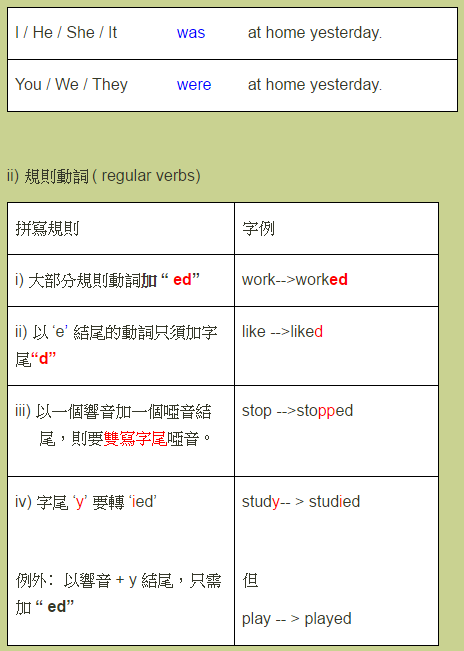

### 過去式  

#### Be 動詞    

#### 用法  
- have/has + ed  (過去分詞)  
Mr. Lee `speaks` good English. He has `learned` English for 20 years.  
表示動作已完成, 或剛剛完成, 但仍然與說話這一個時點有關連或者影響. 
如你第一句例句, Mr. Lee花了二十年學完了英文, 但英文對他現在這個時點仍有作用或者影響.   

- have/has + been + ing 
Mr. Lee speaks good English. He has `been learning` English for 20 years.
表示動作從過去開始進行到現在還未完結, 在未來將會繼續進行. 
多數用來強調若干時間以來"一直"進行某個動作, 所以這類句子通常會有since xxx years / for xxx weeks的時間副詞. 
又或者用來表達 "`到目前為止, 我已經完成了若干部份`....."的意思. 
第二個例句就是說Mr. Lee這二十年來一直在學英文, 到現在還未結束, 而且未來還會繼續學. 

- had + ed 
I had finished typing before lunch  
在說話者描述一件已過去的事件之中, 包含了另一個更早完成的動作, 而且跟說話的時點無關, 才會使用這種句型.   
簡單點說, 就是"在過去某個時點, 某個動作早已經完成了".   
第二組例句中, "I had finished typing before lunch"   
在說話的時點來說, lunch是已經過去的情節, 在這個動作之前, 你已經完成了typing這個動作.   
我再舉一例: "The train had left before I reached the station."   
我抵達車站這件事在我現在說這句話的時候是已經過去了的事, 而在過去我抵達車站之前, 火車已經開走了.   

- had + been + ing 
The bell had been ringing for three minutes before the teacher came into the room.  
跟had + ed差不多, 是指"在過去某個時點, 某個動作從更早的時點在持續進行中"   
例如: "The bell had been ringing for three minutes before the teacher came into the room."    
老師進入課室是過去發生的事, 而在那一個時點, 大鐘已經持續響了三分鐘.   

至於have/has/had + been + ed是被動句, 但時點和事件發生的次序的關係大致上與上面相同  
