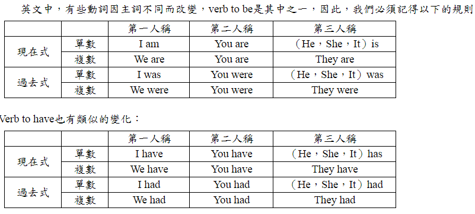

#### 規則（1）：兩個動詞不能聯在一起用，後者的前面必須加“to”或者將後者加入“ing”  
`I love swim.`  
I love to swim.  
I love swimming. 

#### 規則（2）：主詞如果是第三人稱，現在式及單數，動詞必須加s   
`He/Jack/it write very well.`  
He writes very well.  

http://www.taiwantestcentral.com/Grammar/Title.aspx?ID=509  

#### 規則（3）：絕大多數的否定的句子，不能直接加“not”，要用助動詞來完成否定的句子。  

**助動詞本身無意義，是種幫助完成語意的動詞**  
**不限於“do”和它的變型，can、may、might、will、would、must等等都是助動詞**   

`I not like swimming.`  
I do not like swimming.  
I may not like swimming.  

#### 規則（4）：不定詞“to”或助動詞的後面，必須用原形動詞。  

**助動詞 be (am, are, is, was, were)**  
**主要用來幫助主要動詞形成進行式或被動語態**  

英文中的動詞，是會變化的，以have為例，第一人稱和第三人就不同：  
I have a dog. He has a dog.  
`to went` -> to go    

##### 不定詞  

I want to be a teacher.       //am 是助動詞be, 原型為be
He wants to be a good father.  
They all love to be rich.  
No one likes to be poor.  

##### 助動詞   
`He does not goes to work.`  
`You must walked to work.`  

He does not go to work.  
You must walk to work.  

#### 規則（5）：特殊助動詞: have, 後面絕對不能用原形動詞  

I have been to England.  
I have slept all day.  

#### 規則（6）：英文問句要有助動詞  
` How many books you wrote？`
` How many sons you have？`

How many books did you write？ = Did you write how many books?  (助動詞後接原型動詞)  
How many sons do you have？ 

#### 規則（7）：如果動詞是助動詞be 的問句，不用再加助動詞  
Are you a teacher?  
Is he a student?  

#### 規則（８）：特殊動詞隨主詞的變化。  

  
